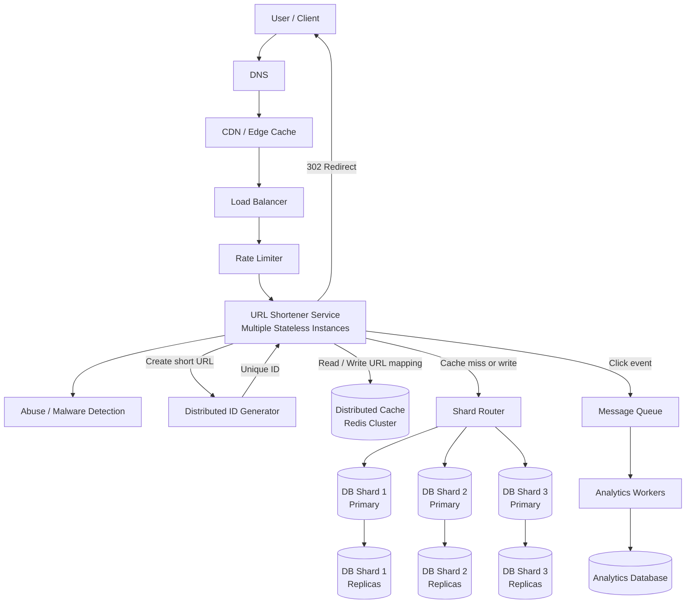

A URL Shortener is a system that converts a long URL into a short URL. For example -

    Long URL:
        https://www.example.com/articles/system-design/database-sharding-and-replication
    
    Short URL:
        https://short.ly/abc123
        
When a user opens the short URL, the system redirects them to the original long URL.

Some popular examples are Bitly, TinyURL, and short links used by social media platforms.

# WHAT ARE WE DESIGNING?

Basically, we need a service where users can submit a long URL, and get a shorter URL in return. Later, when someone visits that short URL, they should be redirected to the original long URL.

At the basic level, the system needs two main feature -

    1. Create a Short URL from a Long URL
    2. Redirect a Short URL to the original Long URL

# REQUIREMENTS

There are two types of requirements - Functional and Non Functional.

Here, the functional requirements can be -

    1. Users can submit a long URL
    2. System returns a unique short URL
    3. Users can open the short URL
    4. System redirects the users to the original long URL
    5. Short URLs should not collide
    6. Optional: Users can set custom aliases
    7. Optional: Links can expire after some time
    8: Optional: Track the click analytics

As for the non-functional requirements, we can have -

    1. High availability
    2. Low latency for redirects
    3. Scalable for large traffic
    4. Durable, so mappings are not lost
    5. Secure against abuse
    6. Eventually consistent analytics is acceptable

For a URL shortener, reads are usually much higher than writes. That is because creating short URLs happens less often but Redirecting short URLs happen must more often.

So, this is a read-heavy system.

# CAPACITY ESTIMATION

Let us say -

    100 Million new short URLs are generated per month
    Each short URL gets around 10 visits on average
    So, 1 Billion redirects happen per month

Approximate requests -

    Write traffic: 
        100 Million / 30 days = 3.3 Million Urls per day
        3.3 Million / 86400 seconds = around 38 writes per second

    Redirect Traffic -
        1 Billion redirects / 30 days = 33 Million redirects per day
        33 Million / 86400 seconds = around 382 reads per second

In a real system, the peak traffic can be much higher than average traffic. So, we should design for the peak load, not for average load.

# STORAGE ESTIMATION

For each URL mapping, we may store these things -

    short_code
    long_url
    user_id
    created_at
    expires_at
    metadata

Let's say each record is around 1 KB. If we create 100 Million URLs per month it means -

    100 Million & 1 KB = 100 GB per month

For 5 years -

    100 GB * 12 * 5 = 6 TB

This is manageable but still large enough to need proper database design.

# API DESIGN

We need two main APIs.

## 1. CREATE SHORT URL

    POST /short-urls

The Request can look something like this -

    {
        "long_url": "https://www.example.com/some/very/long/url",
        "custom_alias": "optional",
        "expires_at": "optional"
    }

The Response can be -

    {
        "short_url": "https://short.ly/abc123",
        "short_code": "abc123"
    }

## 2. REDIRECT SHORT URL

    GET /{short_code}

For example -

    GET /abc123

The Response will be -

    HTTP 301 or HTTP 302 Redirect
    Location: https://www.example.com/some/very/long/url

There are two common redirect status codes -

    301 - Moved Permanently
    302 - Found  (Temporary Redirect)

So, a 301 redirect means the redirect is permanent. The browsers and search engines may cache it. This reduces the load on our service because the browser may directly use the cached redirect later. But, there is a downside.

Since the browser saves or caches the target link, the future clicks go straight to the destination website, so your server never sees them. Your click counts will stop working.

If we want to update or expire the short URL later, the cached redirect may cause issues.

A 302 redirect is a temporary one. Browser usually do bot cache it as aggressively. This gives more control. For example, we can track every click, apply security checks, expire links, or update the destination.

For most URL shorteners, 302 is often preferred because analytics and control are important. But, this still depends. If you want to reduce load, 301 might be the better option.

# DATA MODEL

A simple table can be for url_mappings like this -

    id
    short_code
    long_url
    user_id
    created_at
    expires_at
    is_active

For example -

    short_code: abc123
    long_url: https://www.example.com/articles/system-design
    created_at: 2026-09-05
    expires_at: null
    is_active: true

We should create an index on the short_code because redirects will frequently look up the original URL using the short code.

    Index:
        short_code -> long_url

# HIGH-LEVEL DESIGN

A simple design will be -

    Client -> Load Balancer -> URL Shortener Service -> Database

The flow for creating a short URL will be -

    1. Client sends long URL
    2. Service generates a short code
    3. Service stores the short_code -> long_url in the database
    4. Service returns the short URL

The Flow for redirecting can be -

    1. User opens the short URL
    2. Service extracts the short_code
    3. Service looks up the long_url in the database
    4. Service returns the HTTP Redirect

This works for small scale. But, at large scale, database reads can become a bottleneck. So, what do we do?

Well, we add a cache layer between the service and the database.

    Client -> Load Balancer -> URL Shortener Service -> Cache -> Database

Now, the redirect flow with cache is -

    1. User opens short URL
    2. Service checks cache for short_code
    3. If found, return redirect
    4. If not found, fetch from database
    5. Store result in cache
    6. Return redirect

Since URL shortener is read-heavy, caching is very useful.

## SHORT CODE GENERATION

The most important part of the URL Shortener is generating a unique short code.

There are multiple approaches to generate a short code.

### 1. HASH THE LONG URL

We can has the long URL using MD5, SHA-256 or another hash function, then take the first few characters. For example -

        long_url -> hash -> first 6 characters

The advantages of this is that it is simple and same long URL can generate the same short code. But, there are also disadvantages of this approach.

In this case, collisions can happen so we need collision handling. Moreover hash output may be more than what we need. If two different URLs produce the same prefix, we have a problem.

To handle collision, we have to check if the short_code generated by the hash function already exists. If it exists for the same URL, we return existing code. If it exists for a different URL, we have try a different prefix or add random salt.

So, this approach is simple but not ideal at a very large scale.

### 2. RANDOM SHORT CODE

We generate a random string using characters like  -

    a-z
    A-Z
    0-9

That gives us 62 possible characters. If the length of our short code is 6 -

    62 ^ 6 = 56.8 billion possible codes

If the length is 7, there are 3.5 trillion possible codes.

So, 7 characters gives us a very large space.

The advantages of this method is that it is pretty simple, hard to guess, and no central counter is needed.

But in this method as well, collisions are possible so we need to check database before saving. This is practical if the code space is large enough.

### 3. COUNTER + BASE62 ENCODING

We use an auto-incrementing ID and convert it to Base62. For example -

    id = 125
    Base62(id) = cb

So, the short URL becomes -

    https://short.ly/cb

Base62 uses -

    a-z
    A-Z
    0-9

The advantages here are no collisions, the short codes are compact and they are easy to generate.

Base62 representation of two different numbers is always different. That is why there is no collision issue here.

But, there are also disadvantages like sequential codes can be guessed. A single counter can become a bottleneck. It also need distributed ID generation at scale.

To avoid a single counter bottleneck, we can use -

    1. Database sequence
    2. Snowflake-style ID generator
    3. Pre-generated ID ranges
    4. Multiple ID generation servers

Base62 is commonly used because it creates URL-safe short strings. The characters are -

    a-z
    A-Z
    0-9

So, there are 62 possible values per character. For example, if id is 1000, the base62(id) can be 4c92.

The exact output depends on character ordering. Base62 helps convert large numeric IDs into short readable strings.

## WHICH APPROACH TO CHOOSE?

For interviews, a good answer usually is -

    Use a distributed unique ID generator
    Convert the generated ID to base62
    Use that as the short code

This avoids collisions and gives compact short URLs. If we want short codes to be hard to guess, we can add randomization or use random codes with collision checking.

# DISTRIBUTED ID GENERATION

A Distributed ID Generator is a system that generates unique IDs across multiple machines without depending on a single central server. In a single-machine system, generating IDs is easy.

For example, we can use an auto-incrementing database ID.

But, in a distributed systems, we may have many services creating records at the same time. For example -

    Service A creates a URL
    Service B creates a URL
    Service C creates a URL

If all servers generate IDs independently, they might accidentally generate the same ID. So, we need a way to generate unique IDs safely across multiple machines.

A good ID generator should usually provide -

    1. Uniqueness
    2. High availability
    3. High throughput
    4. Low latency
    5. No single point of failure
    6. Rough time ordering, if needed

Not every system needs all of these.

For example, a payment ID needs strong uniqueness.
A timeline post ID may also benefit from time ordering.
A random tracking ID may not need ordering.

The problem with auto-incrementing database ids is that Every new ID must come from the same database. If thousands of servers need IDs, the database may become overloaded.

Also, there is a single point of failure. If the database is down, ID generation stops. That may stop writes in the whole system. It is also harder to scale across regions and ids are predictable. For example, if one order has ID 1000, the next order may be 1001. This can expose business information or create security problems.

## APPROACH 1 - CENTRALIZED ID SERVICE

One approach is to create a separate ID Generator Service. All the app servers cal this service when they need a ne ID.  The ID Generator Service increments a counter and returns a new ID.

The advantage of this approach is that it is simple and guarantees uniqueness.

But, the ID generation service itself can become a bottleneck. A single ID generation service can become a single point of failure. It also adds network call latency and so, it needs replication/failover strategies.

This is better than putting ID generation inside every application, but it still needs careful scaling.

## APPROACH 2 - ID RANGE ALLOCATION

Instead of asking the central service for every ID, what if each server asks for a range of IDs. For example -

    Server A gets IDs 1 to 1,000,000
    Server B gets IDs 1,000,001 to 2,000,000
    Server C gets IDs 2,000,001 to 3,000,000

Now, each server can generate IDs locally from its assigned range. When a server finishes its range, it asks for a new range.

The advantages are that there are fewer calls to the central service, it is very fast for local ID generation, it is simple to understand, and it has a high throughput.

But, it has some disadvantages. Some IDs may be wasted if a server crashes. Also, IDs may not be perfectly ordered globally. Finally, it still needs a central coordinator that allocates ranges.

For example -

    Server A gets range 1-1000
    Server A uses IDs 1-200
    Server A crashes

IDs 201-1000 may be unused forever.This is usually acceptable because IDs do not need to be gap-free. They only need to be unique.

## APPROACH 3 - UUID

UUIDs are globally unique identifiers. For example -

    550e8400-e29b-41d4-a716-446655440000

They can be generated independently on any machine. The advantages are that there is no central coordination, there is very low collision probability, they are easy to generate and good for distributed systems.

But, they are long, not human-friendly, they need larger index size in databases, and not good for short URLs.

UUIDs are great when ID length does not matter. But for URL shorteners, UUIDs are too long. For example -

        https://short.ly/550e8400-e29b-41d4-a716-446655440000

## APPROACH 4 - SNOWFLAKE ID

Snowflake is a distributed ID generation approach popularized by Twitter. It generates IDs using multiple parts. A common structure is -

    timestamp + machine_id + sequence_number

Example 64-bit layout -

    41 Bits -> timestamp
    10 Bits -> machine id
    12 bits -> sequence number

Because two machines have different machine IDs, they will not generate the same ID. Also, because one machine increments its sequence number within the same timestamp, it will not generate duplicates in the same millisecond.

This creates a unique numeric ID. Then, we can convert this numeric ID to Base62 if we need a shorter string.

Timestamp is used here for rough ordering. IDs generated later usually have larger values.

But Snowflake IDs are not perfectly reliable as timestamps unless clock handling is done carefully.

Sequence number is used because many IDs may be generated in the same millisecond on the same machine so the sequence number handles that. If a sequence has 12 bits, it means one machine can generate 4096 (2^12) IDs per millisecond. That is about 4 Million IDs per second per machine which is a very high throughput.

Now, Snowflake depends on time which means clock issues are important. If a machine clock moves backward, it may generate duplicate IDs. There are some solutions like using a logical clock, refusing to generate IDs until clock catches up, etc.

## APPROACH 5 - RANDOM ID

We can also generate random IDs. For example, generate a 7-character Base62 string. So, there are -

    62^7 = 3.5 trillion possible values

It is easy, and no central coordination is needed. Plus, it is harder to guess. But again, collision is possible here so we need collision check. Collision probability grows as more IDs are created

Random IDs are good when the ID space is large and occasional retries are acceptable.

## WHAT TO CHOOSE?

For a URL Shortener, good choices are -

    1. Snowflake ID + Base62
    2. Random Base62 with collision checking
    3. Range allocation + Base62

If collision-free generation is the main concern, Snowflake or range allocation is better.
If unguessable links is the main concern, random Base62 may be better.

# CACHE DESIGN

Since redirects are read-heavy, cache is very important. We can use Redis or Memcached.

The cache key will obviously be the 'short_code'. The cache value will be the 'long_url'.

For example -

    abc123 -> https://www.example.com/some/long/url

We can use the 'Cache Aside' strategy here -

    1. Check cache first
    2. If cache miss, read from database
    3. Store result in cache
    4. Return redirect

So, popular links can be served mostly from the cache.

# DATABASE CHOICE

The access pattern is simple -

    short_code -> long_url

We do not need complex joins for redirect flow. A NoSQL key-value store can work well here like -

    DynamoDB
    Cassandra
    Redis with Persistence
    MongoDB

A relational database can also work initially such as PostgreSQL or MySQL.

For small to medium scale, SQL is fine. For a very large scale, a distributed key-value store is a good fit.

# SCALING THE SYSTEM

To scale the system -

    1. Add load balancers
    2. Run multiple URL shortener service instances
    3. Use cache for hot URLs
    4. Replicate database for read scalability
    5. Shard database for short_code
    6. Use distributed ID generation
    7. Process analytics asynchronously

The redirect path should be very fast because users expect short links to open quickly.

# ANALYTICS

Many URL shorteners track things such as -

    1. Number of clicks
    2. User location
    3. Browser/Device
    4. Referrer
    5. Timestamp

We should not update analytics synchronously in the redirect path if it makes redirects slow.

A better approach will be -

    1. Redirect request comes in
    2. Service looks up the long URL
    3. Service publishes click event to the queue
    4. Service immediately redirects the user
    5. Analytics workers process the click events later

So -

    URL Shortener Service -> Message Queue -> Analytics Worker -> Analytics Database

# LINK EXPIRATION

Some short URLs may expire. For example -

    Password reset links
    Campaign links
    Temporary invite links

We can store -

    expire_at

And during redirect -

    1. Fetch mapping
    2. Check the expires_at value
    3. If expired, return 404 or expired page
    4. If valid, redirect

Expired links can be cleaned up later using a background job.

# CUSTOM ALIASES

Users may want custom short URLs like -

    https://short.ly/my-product
    
But for this, we nee to ensure the uniqueness. For example -

    1. User submits custom alias
    2. Validate allowed characters
    3. Check if alias already exists
    4. If available, save it
    5. If not available, return error

Custom aliases are more likely to conflict than generated code. So, uniqueness check is required.

# SECURITY AND ABUSE PREVENTION

URL Shorteners can be abused for spam, phishing, and malware links.

We should add protections like -

    1. Validate the long URL format
    2. Block dangerous domains
    3. Rate Limit the URL creation
    4. Detect spammy users
    5. Scan URLs using security services
    6. Allow users to report malicious links
    7. Preview page for suspicious links

Rate limiting is important because attackers may create many malicious short links.

# FAILURE CASES

Some important failure cases are -
    
    1. Database is down
    2. Cache is down
    3. ID generator is down
    4. Short code collision happens
    5. Analytics queue is down
    6. Link is expired
    7. Link does not exist
    8. Malicious URL is submitted

For redirects, availability is very important. If cache is down, service should still try database. If analytics is down, redirect should still work. Analytics should not block the main redirect flow.

# BOTTLENECKS

Let's now talk about the possible bottlenecks and their solutions.

    1. Database reads during redirects -> Use cache
    2. Hot short URLs -> Cache heavily, CDN/Edge caching if possible
    3. ID generation -> Distributed ID generator
    4. Analytics writes -> Queues + Async workers
    5. Cache failures -> Fallback to the database
    6. Abuse/Spam traffic -> Rate Limiting and Detection

So, a good final design can be -

Main redirect path -

    1. Receive short_code
    2. Check cache
    3. If cache miss, read database
    4. Check expiration and status
    5. Publish click event asynchronously
    6. Return 302 redirect

Main create path -

    1. Receive long URL
    2. Validate URL
    3. Generate unique ID
    4. Convert ID to Base62
    5. Store short_code and long_url
    6. Return short URL

# TRADEOFFS

Here are some important tradeoffs -

    1. 301 redirect reduces load but makes analytics and updates harder
    2. 302 redirect gives more control but creates more load
    3. Hashing is simple but collisions must be handled
    4. Counter + Base62 avoids collisions but can be predictable
    5. Random codes are harder to guess but need collision checks
    6. SQL is simple initially, NoSQL scales better for key-value access
    7. Synchronous analytics is accurate but increases latency
    8. Asynchronous analytics is faster but eventually consistent

# INTERVIEW SUMMARY

In an interview, we can explain the design like this -

    I will design a read-heavy URL shortener.
    The core mapping is short_code to long_url.
    For code generation, I will use a distributed ID generator and Base62 encoding.
    Redirects will first check cache, then database.
    Analytics will be processed asynchronously using a queue.
    The database can be sharded by short_code if traffic grows.
    Security protections like rate limiting and malicious URL detection are needed.

# KEY TAKEAWAY

A URL shortener looks simple, but it teaches many important system design ideas -

    Unique ID generation
    Base62 encoding
    Read-heavy scaling
    Caching
    Database indexing
    Redirection
    Asynchronous analytics
    Abuse prevention
    Tradeoffs