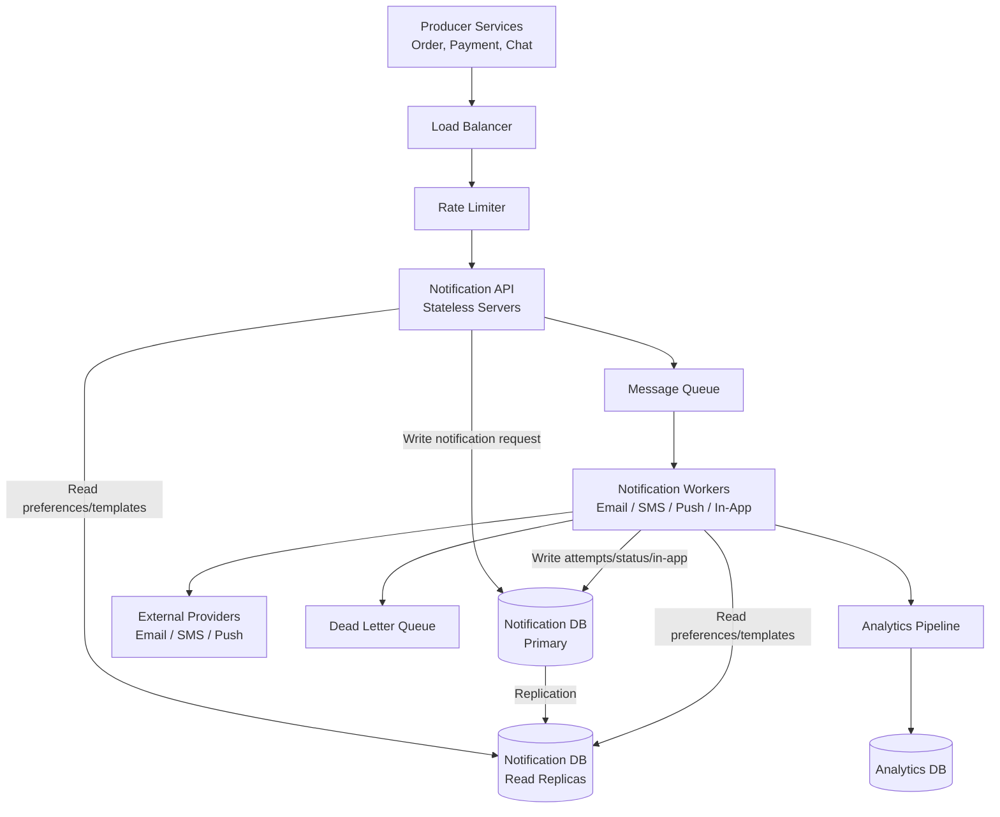

A Notification system is used to send messages or alerts to the users.

For example -

    1. New message received
    2. Order shipped
    3. Payment successful
    4. Password reset email
    5. Friend request received
    6. Low balance warning
    7. Delivery arriving soon

Notifications can be sent through different channels like Email, SMS, Push Notifications, In-app notifications, WhatsApp or other messaging channels.

A notification system looks simple at first, but at scale it needs reliability, retries, user preferences, rate limiting, templates, and failure handling.

# WHAT ARE WE DESIGNING

We are designing a system that allows other services to send notification to the users.

For example -

    Order Service wants to send 'Your order is shipped'.
    Payment Service wants to send 'Payment successful'.
    Chat Service wants to send 'You received a new message'.

Instead of every service directly sending the emails, SMS and push notifications, they call a central Notification System.

This keeps notification logic at one place.

# REQUIREMENTS

## FUNCTIONAL REQUIREMENTS

The system should support these -

    1. Send notifications to a user
    2. Support multiple channels like email, SMS, push notifications, in-app notifications etc.
    3. Support notification templates
    4. Support user notification preferences
    5. Retry failed notifications
    6. Track notification status
    7. Store in-app notifications
    8. Optional: support scheduled notifications
    9. Optional: support bulk notifications

## NON-FUNCTIONAL REQUIREMENTS

The system needs to be -

    1. Highly available
    2. Reliable
    3. Scalable
    4. Fault Tolerant
    5. Eventually consistent
    6. Low latency for important notifications
    7. Secure and abuse-resistant

Some notifications are critical like OTP, Password reset, Payment confirmation etc. On the other hand, some notifications are less critical like Marketing emails, Weekly digest, Product recommendations, etc.

Critical notifications may need a higher priority.

# TYPES OF NOTIFICATIONS

So, what all types of notifications can be there?

## 1. TRANSACTIONAL NOTIFICATIONS

These are triggered by user or business actions. For example - OTP, Password reset, Order confirmation, Payment receipt, Security alert etc.

These notifications should be reliable and fast.

## 2. ENGAGEMENT NOTIFICATIONS

These are the ones used to bring users back. For example - Friend request, New follower, New comment, Product recommendations etc.

These are useful, but usually less critical than transactional notifications.

## 3. MARKETING NOTIFICATIONS

These are promotional. For example - Sale announcement, Discount coupon or Newsletter. These should respect user preferences and unsubscribe rules.

# API DESIGN

Other services can call the Notification System using an API. For example -

    POST /notifications

The request can look like this -

    {
        "user_id": "user_123",
        "type": "ORDER_SHIPPED",
        "channels": ["email", "push"],
        "template_id": "order_shipped_v1",
        "data": {
            "order_id": "ord_789",
            "delivery_date": "2026-09-16"
        },
        "priority": "high"
    }

The response may be -

    {
        "notification_id": "notif_456",
        "status": "accepted"
    }

The API should return quickly after accepting the request. Actual sending of the notification can happen asynchronously.

# HIGH-LEVEL DESIGN

The basic design can be like this -

    Producer Services -> Notification API -> Message Queue -> Notification Workers -> External Providers

By "External Providers" we mean the Email Providers, SMS Providers, Push Notification Providers, etc.

For example -

    Order Service -> Notification Service -> Queue |-> Email Worker ---> Email Provider
                                                   |-> SMS Worker ---> SMS Provider
                                                   |-> Push Worker ---> Push Provider

The queue decouples producers from actual delivery. This means Order Service does not need to wait for the email provider to respond.

Why to use asynchronous processing?

Sending notifications can be slow or unreliable. External providers can fail. For example, Email provider may timeout, SMS provider may reject a request or Push provider may be temporarily down.

If the provider services send notifications directly, they become dependent on these providers. So, a better approach is -

    1. Producer service sends request to Notification API
    2. Notification API validates and stores the request
    3. Event is added to a queue
    4. Workers process the queue
    5. Workers send notifications through providers
    6. Status is updated later

This makes the system more reliable and scalable.

Example: Order shipped notification.

    1. Order Service calls Notification API
    2. Notification API validates the request
    3. Notification API checks user preferences
    4. Notification API creates notification record
    5. Notification API publishes message to queue
    6. Worker consumes message
    7. Worker loads template
    8. Worker fills template with data
    9. Worker sends notification using provider
    10. Worker updates delivery status

A queue is useful because notification sending is asynchronous. We can use separate queues for different  channels. For example, Email Queue, SMS Queue, Push Queue.

Or separate queues by priority like High Priority Queue, Normal Priority Queue, Low Priority Queue.

Critical notifications should not be stuck behind marketing notifications. For example -  OTP should be processed before newsletter emails.
 

# DATA MODEL

We may need these tables or collections for our Notification System.

## 1. notifications

This table/collection stores the main notification request. So, it stores things like -

    notification_id
    user_id
    type
    priority
    status
    created_at
    scheduled_at

## 2. notification_attempts

This one stores each delivery attempt -

    attempt_id
    notification_id
    channel
    provider
    status
    error_message
    attempted_at

## 3. user_preferences

Users should be able to control what notifications they receive.

For example -

    Order updates: email enabled, SMS disabled, push enabled
    Marketing: email disabled, SMS disabled, push disabled
    Security alerts: email enabled, SMS enabled, push enabled

Before sending a notification, the system should check preferences. However, some critical notifications may be mandatory. For example, password reset, OTP, security alert, etc.

Marketing notifications should always respect unsubscribe rules.

The table/collection may stores what notifications a user wants -

    user_id
    notification_type
    email_enabled
    push_enabled
    sms_enabled
    in_app_enabled

## 4. templates

Templates help keep notification content consistent.

Example email template -

    Subject:
    Your order {{order_id}} has shipped

    Body:
    Hi {{user_name}},
    Your order {{order_id}} will arrive by {{delivery_date}}.

The notification request provides data. For example -

    {
        "order_id": "ord_789",
        "user_name": "Arvind",
        "delivery_date": "2026-09-16"
    }

The template engine combines template and data to create the final message. Templates may be different depending on the channel, language, country, notification type, and app version.

The templates table can stores message templates -

    template_id
    channel
    subject
    body
    version
    language

## 5. in_app_notifications

Stores notifications shown inside the application.

    id
    user_id
    title
    body
    is_read
    created_at

# RETRIES

Notification delivery can fail. For example -

    1. Provider timeout
    2. Network failure
    3. Temporary provider outage
    4. Rate limit from the provider

For temporary failures, retry is useful.

    1. Try sending notification
    2. If it fails, wait for some time
    3. Retry with exponential backoff
    4. After max retries, move to dead letter queue

Example retry delays -

    1st retry: 1 minute
    2nd retry: 5 minutes
    3rd retry: 15 minutes
    4th retry: 1 hour

Retries should not happen immediately again and again because that can overload the provider.

If a notification fails even after retries, it can be moved to a Dead Letter Queue. Dead Letter Queue stores messages that could not be processed successfully. Some reasons messages could not be processed may be -

    Invalid email address
    Invalid phone number
    Provider permanently rejects message
    Template data is missing
    Message format is invalid

Engineers can inspect DLQ messages later. Some messages may be fixed and replayed.

# IDEMPOTENCY

The Notification API should support idempotency. Why?

Let's say Order Service sends this request -

    Send order confirmation email

But the network times out before Order Service receives a response. Order Service may retry the same request.

Without idempotency, the user may receive duplicate emails.

The solution is -

    Provider sends an idempotency key

For example -

    idempotency_key = order_123_order_confirmation

If the same key is received again, the Notification System returns the existing notification instead of creating a duplicate. This prevents duplicate notifications.

Duplicates can happen because of retries, queue redelivery, or provider timeouts.

We can do these things to avoid duplicates or reduce them -

    1. Use idempotency keys
    2. Store sent notification records
    3. Deduplicate by user_id + notification_type + event_id
    4. Make workers idempotent
    5. Use provider deduplication if available

Exactly-once delivery is very hard in distributed systems. In practice, we aim for at-least-once processing with idempotent consumers.

# RATE LIMITING

The notification systems may need Rate Limiting. Rate limits protect the users, the providers, and the platform. For example -

    Do not send more than 5 SMS OTPs per user per hour
    Do not send more than 3 marketing emails per user per day
    Do not send more than 1000 emails per tenant per minute

Rate limiting prevents spam, abuse, and high provider costs.

# PROVIDER INTEGRATION

The system may use external providers.

Examples -

    Email: SendGrid, SES, Mailgun
    SMS: Twilio, SNS
    Push: Firebase Cloud Messaging, Apple Push Notification Service

It is good to abstract providers behind an interface.

Example -

    EmailProvider
        sendEmail()

    SmsProvider
        sendSms()

    PushProvider
        sendPush()

This allows us to switch providers if one fails or becomes expensive.

Also, external providers can fail. For important notifications, we can use provider failover. For example -

    Try SMS Provider A
    If Provider A fails, try Provider B

This improves reliability.

But, failover also has risks. For example, if Provider A actually sent the SMS but returned timeout, Provider B may also send it. The user may receive duplicates.

So provider failover should be used carefully, especially for paid channels like SMS.

# PUSH NOTIFICATIONS

Push notifications require device tokens. A user may have multiple devices. For example -

    user_id: user_123
    device_tokens:
        phone token
        tablet token
        laptop token

The system should store device tokens.

When sending push notifications -

    1. Fetch active device tokens for user
    2. Send push to each device
    3. Remove invalid tokens if provider says token is expired

Push notifications may fail if the user uninstalls the app or disables notifications.

# IN-APP NOTIFICATIONS

In-app notifications are stored and shown inside the product.

For example -

    You have a new comment
    Your report is ready
    Your password was changed

For in-app notifications, we write to database.

The frontend fetches them using -

    GET /users/{user_id}/notifications

Or receives them in real time using WebSockets/SSE.

In-app notifications usually need -

    Read/unread status
    Pagination
    Created time
    Notification type
    Link to related object

# ANALYTICS

We may track things like -

    Notification sent
    Notification delivered
    Notification opened
    Notification clicked
    Notification failed
    User unsubscribed

Analytics should usually be asynchronous.

Workers can publish events like -

    NotificationSent
    NotificationFailed
    NotificationClicked

These events can be processed by analytics pipelines.

# SCALING THE SYSTEM

To scale the Notification System -

    1. Use stateless Notification API servers
    2. Use queues to buffer traffic
    3. Scale workers horizontally
    4. Separate queues by channel or priority
    5. Use provider rate limits
    6. Cache user preferences and templates
    7. Partition notification data by user_id or created_at
    8. Use DLQ for failed messages

The queue is especially important because traffic can be bursty. For example, during a sale, millions of notifications may be generated quickly. The queue absorbs the spike and workers process it gradually.

# BOTTLENECKS

The possible bottlenecks are -

    1. Message queue backlog
    2. Provider rate limits
    3. Slow template rendering
    4. User preferences database
    5. Notification database writes
    6. Large bulk campaigns
    7. Retry storms during provider outage

The solutions are -

    Queue backlog -> scale workers horizontally
    Provider rate limits -> throttle per provider
    Slow templates -> cache templates
    Preferences DB load -> cache preferences
    Notification DB writes -> partition by user_id or time
    Bulk campaigns -> schedule and batch sending
    Retry storms -> exponential backoff and circuit breaker

# TRADEOFFS

    1. Synchronous sending is simpler but slower and less reliable
    2. Asynchronous sending is scalable but eventually consistent
    3. More retries improve reliability but may create duplicates
    4. Provider failover improves availability but can increase duplicate risk
    5. Caching preferences improves speed but may use stale preferences
    6. Separate queues improve isolation but increase operational complexity
    7. Storing every attempt improves debugging but increases storage cost

# FINAL DESIGN

The final design can look like this -

In an interview, we can explain the design like this -

    I would design the notification system as an asynchronous service.
    
    Producer services call the Notification API.
    
    The API validates the request, checks user preferences, stores the notification,
    and publishes a message to a queue.
    
    Channel-specific workers consume messages and send email, SMS, push, or in-app notifications.
    
    Failed notifications are retried with exponential backoff and moved to a dead letter queue after max retries.
    
    The system uses idempotency keys to avoid duplicate notifications.
    
    User preferences, templates, provider rate limits, and analytics are handled separately.