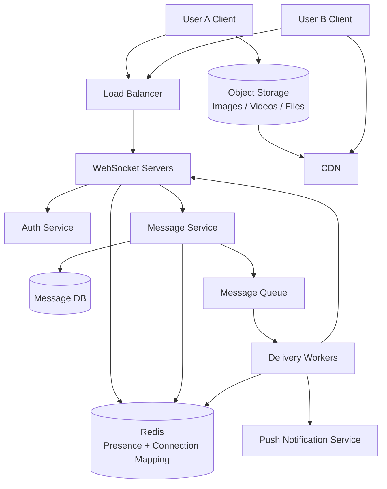

A Chat system is a system that allows users to send and receive messages in real time.

It can have the following features -

    1. One-to-one chat
    2. Group chat
    3. Message delivery status
    4. Offline/Online status
    5. Typing indicator
    6. Message history
    7. Push notifications for offline users

We are designing a system where users can send messages to each other. So -

    User A sends 'Hello' to User B.
    User B should receive the message in real time if online.
    If User B is offline, the message should be stored and delivered later.

At the basic level, the system needs two main things - 

    1. Send messages
    2. Receive messages

# REQUIREMENTS

## 1. FUNCTIONAL REQUIREMENTS

The system should supports -

    1. One-to-one messaging
    2. Group messaging
    3. Store message history
    4. Real-time message delivery
    5. Offline message delivery
    6. Message delivery status
    7. Optional: Read receipts
    8. Optional: Typing indicator
    9. Optional: Media messages like images or videos.

## 2. NON-FUNCTIONAL REQUIREMENTS

The system needs to be -

    1. Highly available
    2. Eventually consistent
    3. Scalable
    4. Reliable
    5. Fault Tolerant
    6. Low Latency
    7. Secure

For chat systems, low latency is important. Users expect messages to appear almost instantly.

# HIGH-LEVEL DESIGN

AT high-level, a simple design would be -

    Client -> Load Balancer -> Chat Service -> Database

So, the flow is -

    1. User A sends a message.
    2. Chat Service receives the message.
    3. Chat Service stores the message in the database.
    4. Chat Service sends message to User B
    5. User B receives the message

But, normal HTTP request-response is not ideal for a real-time chat. So, we need a persistent connection between the client and the serve. So, the common options are -

    1. Long Polling
    2. Server-sent Events
    3. WebSockets

For chat systems, WebSockets are usually a good choice because communication is two-way.

## WEBSOCKET CONNECTION

When the user opens the app -

    1. Client connects to WebSocket server
    2. Server authenticates the user
    3. Server stores the connection information
    4. User can now send and receive messages in real time

    User A Client <--> WebSocket Server <--> User B Client

So, if the User B is connected, messages can be pushed immediately.

If User B is not connected, the messages can be stored in the database and delivered when the user comes online.

For one-to-one messages -

    1. User A sends message to WebSocket Server
    2. WebSocket Server validates the message
    3. Message Service stores the message
    4. Message Service checks if User B is online
    5. If User B is online, message is pushed to User B
    6. If User B is offline, message stays in database
    7. Push notification can be sent to User B

We should store the message before sending the acknowledgement to the sender.

Why?

Because if the acknowledgement is sent before saving the message and the database write failed, the sender would think the message was sent. But in reality, the message is lost.

# DATA MODEL

We may need these tables or collections.

## 1. users

This is the table that stores the user information -

    user_id
    name
    phone/email
    created_at

## 2. conversations

This is the table to store the chat or conversation information. It can have these columns -

    conversation_id
    type
    created_at

Here, 'type' can be either 'one_to_one' or it can be 'group'.

## 3. conversation_members

This table stores the users in a conversation. It can have columns including -

    conversation_id
    user_id
    joined_at
    role

## 4. messages

This is the table that stores the actual messages. So, it has -

    message_id
    conversation_id
    sender_id
    content
    message_type
    created_at
    status

Here, message type can be 'text', 'image', 'video', 'file' and so on.

## 5. user_connections

This table is used to store the WebSocket connections. It can have -

    user_id
    server_id
    connection_id
    last_seen_at

This helps us know where a user is connected.

# GROUP CHAT

One of the most common features of a Chat System is Group Chat. But, it is also one of the most complex to handle.

For a small group, the message flow can be -

    1. User sends message to group
    2. Store message in database
    3. Fetch group members
    4. Push message to all online members
    5. Send notifications to offline members
    
For large groups, however, pushing messages to each member immediately is not the best idea. It is expensive. So, for large groups, we can use Fan-out. 

Fan-out in system design is an architectural pattern where a single incoming request, task, or event triggers multiple parallel downstream calls or messages to different services, workers, or destinations.

There are two main approaches 

    1. Fan-out on Write (Push Model)
    2. Fan-out on Read (Pull Model)

## 1. FAN-OUT ON WRITE (PUSH MODEL)

In this approach, when a sender posts a message to a group or chat room, the system looks up all group members and immediately writes a copy of that message into each recipient's personal message queue or inbox table.

For example -

    Group has 100 members
    One message is sent
    System creates delivery entry for 100 users

The advantages of this is -

    1. Reading messages is fast. When a user opens a chat, the messages are already there, resulting in very low read latency.
    2. Each user can have their own inbox. Tracking unread message counts and read receipts is straightforward because each user has their own dedicated copy of the inbox data.
    3. Good for small and medium groups

The disadvantages is -

    1. Expensive for large groups. The number of database writes scales linearly with group size. Sending a single message to a group of 10,000 people triggers 10,000 individual write operations.
    2. Storage concerns. The identical message is duplicated across thousands of storage locations.
    3. Large celebrity groups can create huge Fan-out
    4. Editing or deleting a message requires updating or removing it from every single user's inbox copy

## 2. FAN-OUT ON READ (PULL MODEL)

In this approach, when a sender transmits a message, the system saves it just once in a central table or log for that specific chat room or conversation. The system does not distribute the message until a recipient opens the chat and explicitly requests the new message

The benefits are -

    1. Less write load. There is a single write when a message is sent, regardless of how many users are in the group.
    2. Good for very large groups
    3. Message is stored once so it also offers storage efficiency.
    4. Editing or deleting a message only requires changing that single central record

But, there are disadvantages as well -

    1. Reads can be heavier. When a user opens a chat, the system has to query, fetch, and assemble messages on demand, which increases load and latency.
    2. Need efficient pagination
    3. Per-user read status becomes harder
    4. Computing unread counts and sorting message histories dynamically requires heavier read-time logic and caching layers.

Each has their own benefits and downsides. While Fan-out on Write means extremely fast reads, it also means heavy write performance that multiplies with group size. While Fan-out on Read means fast writes (since there is a single write), it also means slower reads.

So, for 1-to-1 chats or small groups, Fan-out on Write is a good option. For large groups or broadcast channels, Fan-out on Read is preferred.

# MESSAGE QUEUE

We can add a message queue between the message service and delivery workers.

The design can be -

    Client -> WebSocket Server -> Message Service -> Message Queue -> Delivery Workers -> WebSocket Servers

So, why do we need a queue here?

That is because message delivery can have spikes. For example, if many users send messages at the same time, the queue buffers the traffic and delivery workers process messages asynchronously.

The flow becomes -

    1. Message Service stores message
    2. Message Service publishes event to queue
    3. Delivery Worker consumes event
    4. Delivery Worker finds recipient connections
    5. Delivery Worker pushes message to correct WebSocket server
    6. WebSocket server sends message to client

# ONLINE STATUS

To show the online/offline status, WebSocket servers can update presence. For example -

    user_id -> online
    user_id -> last_seen_it

Presence data can be stores in Redis because it changes frequently.

When the user connects - 

    Mark the user as online

When user disconnects -

    Mark the user as offline or update the last_seen_at

But, disconnect detection is not always instant. Network may drop silently. So the client can send heartbeat messages.

    Client sends heartbeat every 30 seconds
    Server updates last_seen_at
    If no heartbeat for some time, user is considered offline

# DELIVERY STATUS

Message status can be -

    send
    delivered
    read

The flow can be -

    1. Sender sends message
    2. Server stores message
    3. Server returns sent acknowledgement
    4. Receiver receives message
    5. Receiver sends delivered acknowledgement
    6. Receiver opens chat
    7. Receiver sends read acknowledgement

So -

    Sent means server accepted the message.
    Delivered means recipient device received the message.
    Read means recipient opened or saw the message.

# OFFLINE USERS

When the recipient is offline -

    1. Store the messages in database
    2. Do not lose the message
    3. Send push notification
    4. Deliver message when user reconnects

When the user comes online -

    1. Client connects to WebSocket server
    2. Client sends the last_received_message_id
    3. Server fetches the missed messages
    4. Server sends the missed messages to the client

This helps recover from disconnects also.

# MEDIA MESSAGES

For images, videos, and files, we should not send large files directly through chat servers. A better approach is Object Storage -

    1. Client uploads media to object storage
    2. Object storage returns media URL
    3. Client sends chat message with media URL
    4. Receiver downloads media from object storage/CDN

    Client -> Object Storage -> CDN
    Client -> Chat Service -> Message metadata

This keeps chat servers lightweight.

We can keep metadata in our database like message text, sender IDs, timestamps, and the object's file URL. The media can live in the Object Storage such as Amazon S3 or Google Cloud Storage. We can pair object storage with a Content Delivery Network (CDN) to stream or download media quickly anywhere in the world.

When a user attaches a photo or video and hits "Send," the app performs a two-step process: uploading the file and sending the message metadata.

## THE SENDER FLOW 

Step 1: Request an upload token. The sender's app tells the chat server: "I want to upload a 5MB JPEG."

    [ Sender App ] ------------(1) Request Upload URL ------------> [ Chat Server ]

Step 2: Generate a Presigned URL. The chat server generates a temporary, secure presigned URL from the Object Storage provider and sends it back to the app. This allows the app to upload directly without needing global admin credentials.

    [ Sender App ] <--------(2) Presigned Upload URL -------------- [ Chat Server ]

Step 3: Direct binary upload. The sender's app uploads the raw media file directly to Object Storage using that presigned URL. This keeps heavy file traffic off your main chat server.

    [ Sender App ] -----(3) Upload Binary File (Direct) ----> [ Object Storage ]

Step 4: Send the chat message. Once the upload succeeds, the app sends a lightweight JSON payload to the chat server via WebSockets or HTTP. For example -

    {
        "sender_id": "user_A",
        "receiver_id": "user_B",
        "message_type": "image",
        "media_url": "https://amazonaws.com",
        "timestamp": "2026-09-20T18:30:00Z"
    }

    [ Sender App ] ------------(4) Send Message Metadata ---------> [ Chat Server ]

Step 5: Persist metadata. The chat server saves this small JSON object into the main database.

    [Chat Server ] ---------> (5) [ Save to Database ]

## THE RECEIVER FLOW 

When the message is delivered to the recipient, the app uses a CDN (Content Delivery Network) to download the file quickly, rather than pulling it directly from the origin storage bucket every time.

Step 1: Deliver the metadata. The chat server pushes the JSON message payload (containing the media_url) to the receiver's app over an open WebSocket connection or a push notification.

Step 2: Render a placeholder. The receiver’s app displays the chat bubble immediately. It might show a blurred thumbnail or a loading spinner using metadata (like image dimensions) included in the initial payload.

Step 3: Fetch from the CDN. The receiver's app requests the media file using the provided URL. However, the URL points to a CDN (like Cloudflare or Amazon CloudFront) acting as a shield in front of the Object Storage.

If cached (CDN Cache Hit): The CDN serves the image instantly from a local edge server closest to the receiver.

If not cached (CDN Cache Miss): The CDN pulls the file from the Object Storage bucket, caches it for future requests, and delivers it to the receiver.

# DATABASE CHOICE

Chat messages are write-heavy and read-heavy. Access patterns are usually -

    1. Get recent messages in a conversation
    2. Get message before a message_id
    3. Store new messages quickly
    4. Query by conversation and created_at

A good primary key can be -

    conversation_id + message_id

OR

    conversation_id + created_at

We can use databases like -

    Cassandra
    DynamoDB
    HBase
    MongoDB
    PostgreSQL initially

For large scale, distributed NoSQL databases are commonly used because message volume can be large.

For chat systems, there is no single database that does everything. Instead, production architectures use a hybrid database approach combining NoSQL databases for storing the message history and Relational (SQL) databases or Key-Value caches for user profiles and session management.

Wide-Column Stores (Cassandra / ScyllaDB) are ued by giants like Discord and Facebook Messenger. They excel at handling petabytes of data across multiple servers with zero downtime. They store data ordered by chat room and timestamp, making history fetches incredibly fast.

Document Databases (MongoDB / AWS DynamoDB) are highly popular for smaller to medium-scale apps. They store messages as flexible JSON documents, which makes it easy to add new fields (like reactions, read receipts, or threads) without changing a rigid database schema.

For managing who a user is, who their friends are, and group channel memberships, Relational (SQL) Databases are preferred because they strictly enforce data integrity. PostgreSQL / MySQL handle structured data where complex relationships matter (e.g., ensuring a user cannot post in a private group unless they are explicitly mapped as a member of that group).

For features that change every second, chat systems rely on In-Memory Key-Value Stores. For example, Redis is used to track user online/offline status ("presence"), manage transient WebSocket session tokens, and cache the most recent 50 messages of active chat rooms so databases aren't hit constantly.

# CACHING

Cache can be used for -
    
    1. Recent messages
    2. User presence
    3. Conversation members
    4. User connection mapping

Redis is useful for presence and connection mapping.

## 1. PRESENCE TRACKING

In a chat app, you need to know exactly when your friends are online, offline, or typing. Checking a disk-based database every few seconds for millions of users would crash it.

Redis stores this information as simple key-value pairs (e.g., user:1234:status -> "online"). Because it is in memory, it can handle hundreds of thousands of status updates per second without breaking a sweat.

Redis has a feature called TTL (Time-To-Live). If a user's app stops sending a "heartbeat" signal for 30 seconds, Redis automatically deletes the key and marks them offline.

## 2. MESSAGE ROUTING / CONNECTION MAPPING

When User A sends a message to User B, the chat server needs to figure out exactly which server connection User B is currently hooked up to and push the message to them instantly.

Redis acts as a real-time message router. It allows servers to "subscribe" to chat rooms or specific user IDs. When a new message comes in, Redis broadcasts it to the correct recipient's server connection in sub-millisecond time.

## 3. RECENT MESSAGES

When a user opens a chat app, they expect their most recent 20 or 50 messages to load instantly. Redis handles this using a data structure called a List or Sorted Set. The backend pushes the latest messages to Redis while asynchronously saving them to the main permanent database (like Cassandra or PostgreSQL). When the app loads, it fetches the recent history straight from the super-fast Redis cache, bypassed the heavier main database entirely.

# SCALING THE SYSTEM

To scale a chat system - 

    1. User multiple WebSocket servers
    2. Keep WebSocket servers stateless as much as possible
    3. Store connection mapping in Redis
    4. User message queue for delivery
    5. Partition messages by conversation_id
    6. Cache recent messages
    7. Store media in object storage
    8. Use push notifications for offline users

WebSocket servers maintain many long-lived connections, so we need to scale them horizontally.

# BOTTLENECKS

The possible bottlenecks are -

    1. Too many WebSocket connections
    2. Message database writes
    3. Hot group chats
    4. Presence updates
    5. Message fanout
    6. Media upload/download
    7. Push notification provider limits

The solutions are -

    Too many WebSocket connections -> scale WebSocket servers horizontally
    Message database writes -> partition by conversation_id
    Hot group chats -> fanout on read or special handling
    Presence updates -> use Redis and heartbeat batching
    Message fanout -> queue + delivery workers
    Media upload/download -> object storage + CDN
    Push limits -> rate limit and retry

# FINAL DESIGN

The final design of our chat system can be like this -

So, in an interview, we can say -

    I would design the chat system using WebSocket for real-time communication.

    Clients connect to WebSocket servers and keep persistent connections.

    When a user sends a message, the server stores it in the message database first.

    Then the message is published to a queue.

    Delivery workers check recipient connection information from Redis and push the message to the correct WebSocket server.

    If the recipient is offline, the message remains stored and push notification can be sent.

    Message history is fetched from the database using conversation_id and message_id.

    Presence is stored in Redis using heartbeat updates.

    Media files are uploaded to object storage and only metadata is sent through chat.