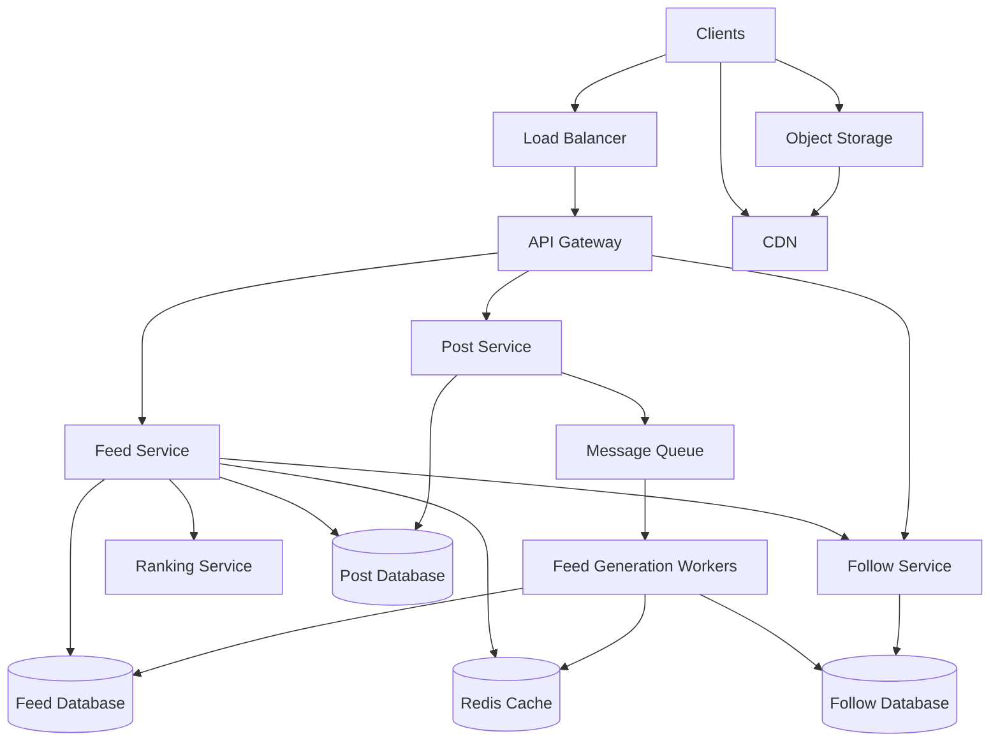

A news feed system shows the users a list of posts, updates, images, videos, or articles from people and pages they follow.

For example -

    1. Facebook news feed
    2. LinkedIn feed
    3. Instagram feed
    4. Twitter/X timeline

The main challenge here is generating a personalized feed quickly when there are millions of users and posts.

# REQUIREMENTS

## FUNCTIONAL REQUIREMENTS

The system should allow the user to -

    1. Create, edit, and delete posts
    2. Follow and Unfollow users
    3. View a personalized news feed
    4. Like and comment on posts
    5. Upload images and videos
    6. Refresh the feed and load older posts
    7. View posts in chronological or ranked order

## NON-FUNCTIONAL REQUIREMENTS

The system should have -

    1. Low latency
    2. High availability
    3. Eventual consistency for feed updates
    4. Horizontal scalability for millions of users
    5. Reliable post storage
    6. Efficient handling of celebrity users with millions of followers
    7. Protection against duplicate posts and repeated feed items
    8. Support for pagination and continuous scrolling

It is okay if the feed is eventually consistent. A newly created post does not need to appear for every follower immediately.

# BASIC DESIGN

The main components of the news feed can be -

    1. Load Balancer
    2. API Gateway
    3. Feed Service
    4. Post Service
    5. Follow Service
    6. Feed Generation Workers
    7. Message Queue
    8. Feed Database
    9. Redis Cache
    10. Object Storage
    11. CDN

The basic flow can be -

    Client
    |
    Load Balancer
    |
    API Gateway
    |
    +--> Post Service
    +--> Feed Service
    +--> Follow Service

The Load Balancer distributes the requests across multiple API Gateway instances. The API Gateway handles the authentication, rate limiting, and routing.

# CREATING A POST

When a user creates a post -

    1. A request is sent to the Post Service
    2. The post is stored in the Post Database
    3. The 'PostCreated' event is sent to the Message Queue
    4. Feed Generation workers process this event
    5. The post is added to the feeds for relevant followers

The post creation request should not wait until all followers' feeds are updated.

    Client
    |
    Load Balancer
    |
    API Gateway
    |
    Post Service
    |
    Post Database
    |
    Message Queue
    |
    Feed Generation Workers

# FEED GENERATION

There are two common approaches -

    1. Fan-out on Write
    2. Fan-out on Read

### 1. FAN-OUT ON WRITE

When a user creates a post, the system adds the post to the feed of all the followers.

    User creates post
       |
    Find followers
        |
    Add post to their feeds

This makes the feed reads very fast because the feed is already present.

But, it becomes expensive when a user has millions of followers. In this case, one post can create millions of operations.

### 2. FAN-OUT ON READ

In this approach, when a user opens the feed, the system fetches the recent posts from all the followed users and combines them.

This reduces the work during the post creation, but reading the feed becomes more expensive because the system has to fetch and merge a lot of posts.

### HYBRID APPROACH

A better approach is to use both methods.

For normal users, fan-out on write can be used. Their posts can be added to the follower feeds when they are created.

For users with millions of followers, we can use fan-out on read. Their posts are stores normally and fetched when the followers open their feed. This avoids creating millions of writes for every celebrity post while keeping normal feed reads fast.

## READING THE FEED

When a user opens the feed -

    1. Feed Service checks Redis
    2. If the feed is available, it returns the cached post IDs
    3. If not, it reads the feed from the Feed Database
    4. It fetches the posts from popular users if needed
    5. It removes the duplicates and applies the ranking
    6. It returns the final feed

The feed should use cursor-based pagination.

    GET /feed?cursor=last_post_id&limit=20

Cursor pagination works better than offset-based pagination because new posts can be created while the user is scrolling.

## RANKING THE POSTS

Initially, the posts can be sorted by the creation time. Later, the system can rank the posts using -

    1. Recency
    2. Likes and comments
    3. Relationship with the author
    4. User interests
    5. Previous interactions

For example, a post from a close friend with recent activity may appear above an older post with less engagement.

The Ranking Service can calculate a score for every post before returning the feed.

# DATA MODEL

Let's now design the database tables.

We can have a 'posts' table that stores the actual posts created by the users. The table can have these columns -

    post_id
    author_id
    content
    created_at
    updated_at
    visibility
    like_count
    comment_count

We can create an index - 

    (author_id, created_at)

This helps fetch recent posts created by a user.

Next, we can have a 'users' table to store basic user information -

    user_id
    name
    email
    profile_image_url
    created_at

Next, we can have a 'follows' table to keep the relationship between the users -

    follower_id
    followed_id
    created_at

The primary key can be -

    (follower_id, followed_id)

Indices can be created on both the 'follower_id' and 'followed_id'. The helps answer who follows this user and also who does this user follows.

We can also create a 'feed_items' table to store the posts that should appear in a user's feed -

    user_id
    post_id
    author_id
    created_at
    rank_score

The primary key can be -

    (user_id, post_id)

The table can be partitioned by the 'user_id'. For example, when a user '101' opens the feed, the system can quickly fetch all the feed items belonging to that user.

A table named 'likes' can be used to store which users liked which posts -

    user_id
    post_id
    created_at

The primary key will be -

    (user_id, post_id)

This prevents the same user from liking the same post multiple times.

For comments, we can have a 'comments' table -

    comment_id
    post_id
    user_id
    content
    created_at
    updated_at

The index can be -

    (post_id, created_at)

This helps fetch comments for a post in order.

For media, we can create a 'media' table -

    post_id
    media_type
    media_url
    created_at

The actual image or video should be stored in Object Storage. The database stores only its URL and metadata.

If one post can have multiple images or videos, we can create a separate mapping table, let's say we name it 'post_media' -

    post_id
    media_id
    display_order

So, this is how the relationship will be between the tables -

    Users
    |
    +--> posts
    |
    +--> follows
    |
    +--> likes
    |
    +--> comments

    Posts
    |
    +--> feed_items
    |
    +--> comments
    |
    +--> likes
    |
    +--> media

Note that 'feed_items' is not the original post data. The 'posts' table will store the actual post. The 'feed_items' table only keeps which posts should appear in a particular user's feed.

For celebrity users, their posts may not be inserted into every follower's 'feed_items' table. Instead, their posts can be fetched during feed generation and merged with the precomputed feed.

# CACHING

Recent feed items can be stored in Redis -

    feed:user_123

The cache can store the latest few hundred post IDs for each user.

The complete post content can still be read from the Post Database or another cache.

The cache should have a size limit. Very old feed items can be removed from Redis and fetched from the database when required.

# MEDIA FILES

Images and Videos should not be stored directly in the database. The client can upload them to an Object Storage -

    Client
    |
    Object Storage
    |
    CDN
    |
    Other Users

The Post Database stores only the media URL. The CDN serves the media faster and reduces load on the application servers.

# SCALING AND BOTTLENECKS

The system can scale by -

    1. Running multiple API Gateway instances
    2. Running multiple Feed and Post Service instances
    3. Partitioning the feed data by the user_id
    4. Adding more feed-generation workers
    5. Using Redis for frequently accessed feeds
    6, Using a CDN for images and videos
    7. Using a message queue to handle traffic spikes.

The biggest problem is a user with millions of followers.

If the system uses fan-out on write for such a user, one post can generate too many writes. The hybrid approach solves this by using fan-out on read for popular users.

Another problem is a cache miss for many users at the same time. Request deduplication and cache warming can reduce the load on the database.

# FINAL DESIGN

A news feed mainly depends on how posts are distributed to followers.

Fan-out on write makes reading fast but can create too many writes.

Fan-out on read reduces writes but makes reading slower.

A hybrid approach works well:

    1. Fan-out on write for normal users.
    2. Fan-out on read for users with millions of followers.
    3. Redis for recent feeds.
    4. Message Queue for asynchronous feed generation.
    5. CDN for images and videos.