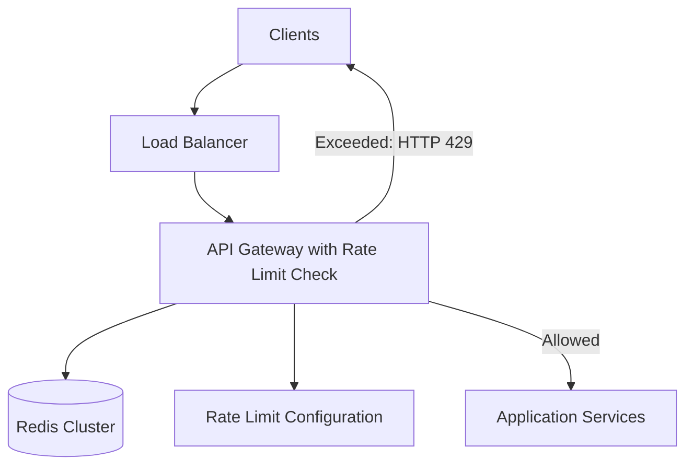

A rate limiter controls how many requests a user or a client can make in a given time.

For example, an API may allow a user to make 100 requests per minute. If they exceed that limit, the system can reject or delay the further requests.

Rate Limiters help protect the services from overload, accidental traffic spikes, and abusive clients.

Normally, the rate-limit check is part of the API Gateway =

    Client -> Load Balancer -> API Gateway (Rate Limit Check) -> Application Services

The API Gateway checks the request before sending it to the application service. For some systems, rate limiting can also happen in the service mesh or inside an individual service. To apply common limits across APIs, Gateway-level limiting is useful.

# REQUIREMENTS

## 1. FUNCTIONAL REQUIREMENTS

The system should allow us to -

    1. Set different limits for different users, APIs or plans
    2. Count requests over a time period
    3. Allow requests that are within the limit
    4. Reject the requests that exceed the limit
    5. Return information about the limit and when can the client retry
    6. Support limits at different levels like per user, per IP address, per API key etc

## 2. NON-FUNCTIONAL REQUIREMENTS

The system should have -

    1. Low latency because every request may pass through it
    2. High availability
    3. The ability to handle a large number of requests
    4. Consistent limits across multiple application servers
    5. Fault tolerance, so a rate limiter failure does not bring down the entire service
    6. Configurable limits that can be changed without re-deploying the application

# BASIC REQUEST FLOW

When a request arrives -

    1. Identify the client using a user ID, API key, or IP address.
    2. Find the rate limit for that client and API.
    3. Check how many requests they have made.
    4. Allow the request if they are within the limit.
    5. Otherwise, reject it and return a retry time.

So, t he flow can be -

    Request
        |
    Identify client
        |
    Check request count
        |
    Within limit?
        +--> Yes: forward request
        |
        +--> No: reject request

A rejected request commonly receives HTTP status 429 Too Many Requests.

# RATE LIMITING ALGORITHMS

## FIXED WINDOW

Divide time into fixed intervals and count requests in each interval.

For example, allow 100 requests per minute. The counter resets at the start of each minute.

This is simple to implement, but a client can send many requests near a window boundary. For example, 100 requests at 12:00:59 and another 100 at 12:01:00.

## SLIDING WINDOW LOG

Store the timestamp of every request and count the requests within the last time period.

For example, to check a limit of 100 requests per minute, count requests from the previous 60 seconds.

This is accurate, but storing every request timestamp can use a lot of memory.

## SLIDING WINDOW COUNTER

Combine the current window count with part of the previous window count.

This reduces the boundary problem of the fixed window and uses less memory than storing every request timestamp. The result is an estimate rather than an exact count.

## TOKEN BUCKET

Each client has a bucket of tokens. A request consumes one token. Tokens are added to the bucket at a steady rate, up to a maximum capacity.

For example, a bucket may hold 10 tokens and refill at 1 token per second. The client can make a short burst of requests, but cannot keep sending requests faster than tokens are added.

This is useful when we want to allow occasional bursts while limiting the average request rate.

## LEAKY BUCKET

Requests enter a queue and are processed at a steady rate. If the queue is full, new requests are rejected.

This smooths out traffic bursts, but requests may have to wait in the queue.

##  WHICH ALGORITHM TO USE?

Token bucket is a good general choice because it allows small bursts while controlling the average request rate.

A sliding window counter is another practical choice when we want a request limit over a rolling time period with modest memory usage.

The algorithm depends on whether the system should allow bursts, queue requests, or enforce a strict rolling limit.

# DISTRIBUTED RATE LIMITING

If requests can reach multiple API Gateway instances, each instance must use a shared rate-limit state.

For example, if each serer keeps its own counter, a client can exceed the limit by sending requests to different servers. A common design is to store counters or bucket state in Redis.

    API Gateway 1 ----\
    API Gateway 2 -----+----> Redis
    API Gateway 3 ----/

The gateway checks and updates the state in Redis before forwarding the request. The check and update should happen atomically. Otherwise, two severs can read the same count a the same time and both allow a request that should have been rejected.

For a fixed size window, a key might look like this -

    rate_limit:user_123:api_x:minute_10_30

The value stores the request count and the key expires when the time window ends.

For Token Bucket, the stored state in Redis may include -

    tokens_remaining
    last_refill_time

The key should include the client and the limit scope, such as user, API, or plan.

A request can be subject to more than one limit. For example, it may be limited both per user and per API endpoint. The request should be allowed only if it passes all applicable limits.

# CONFIGURING THE LIMITS

Rate Limits can be stored in a configuration service or a database. For example -

    RateLimitConfig
    ---------------
    scope
    limit
    window_seconds
    algorithm
    updated_at

For example -

    user:123, API:search, 100 requests, 60 seconds

The API gateway can cache configuration briefly so it does not need to fetch it for each request.

For faster updates, a configuration store such as ZooKeeper can notify API Gateway instances when a rule changes. The gateways then read the latest rules and refresh their local cache. Requests continue using the cached rules instead of calling ZooKeeper each time.

The effective limit can depend on the user's current plan or other attributes. For example, a free user may get 100 requests per minute, while a premium user gets 1,000. The gateway identifies the user and plan, then applies the matching rule. When a plan changes, the updated rule should take effect after the cached configuration expires or is refreshed.

When a request is rejected, return 429 Too Many Requests. The response can include -

    Retry-After: 12

This tells the client to retry after 12 seconds. The API can also return limit information, such as the request limit and remaining requests.

# FAILURE HANDLING

The rate limiter depends on shared state, so Redis or the rate-limit service may become unavailable.
The system needs a failure policy:

    - Fail open: allow requests if the rate limiter is unavailable. This keeps the API available, but may allow excess traffic.

    - Fail closed: reject requests if the rate limiter is unavailable. This protects the service, but may block legitimate users.

The choice depends on the API. A low-risk public endpoint may fail open, while an expensive or sensitive endpoint may fail closed.

# BOTTLENECKS

## Redis Load

Every request may read and update rate-limit state in Redis.

Use Redis clusters, keep operations small, and group related work into atomic operations.

## Hot Keys

A very popular API key or IP address may cause many requests to hit the same Redis key.

Partitioning or local limits can reduce pressure, but local limits may allow some excess requests across gateway instances.

## Clock Differences

Time-based algorithms can behave incorrectly if servers have significantly different clocks.

Use a consistent time source or use Redis server time when updating shared state.

# FINAL DESIGN

To recap -

    A limiter checks requests before they reach application services.

    For a distributed system, gateway instances need shared state so a client cannot bypass the limit by reaching different servers.

    Token bucket is a useful default when small bursts are acceptable. Redis can hold shared state, and the check-and-update operation must be atomic.
